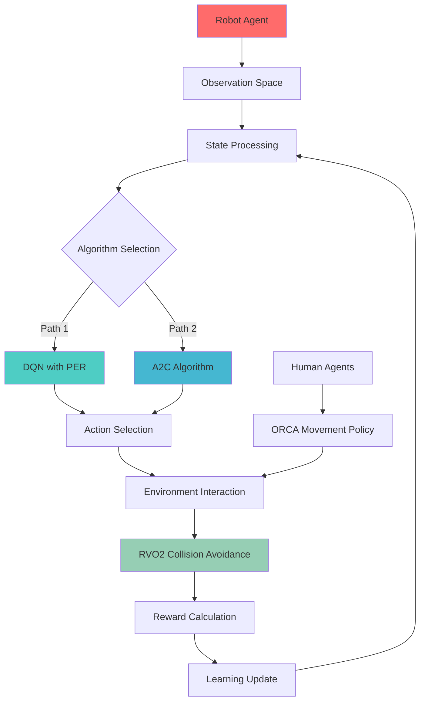
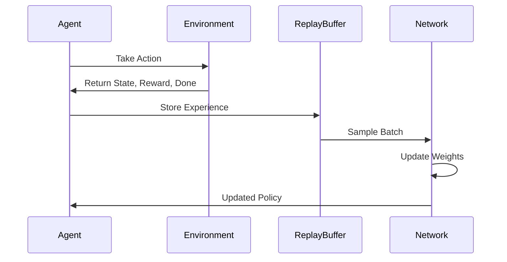

# 🤖 OPTIMIZING ROBOT NAVIGATION IN DYNAMIC ENVIRONMENTS
## Robot Navigation Simulation Using Deep Reinforcement Learning

[](https://opensource.org/licenses/Apache-2.0)
[](https://www.python.org/)
[](https://pytorch.org/)
[](https://gymnasium.farama.org/)

---

## 📋 Table of Contents
- [🎯 Project Overview](#-project-overview)
- [✨ Key Features](#-key-features)
- [🏗️ System Architecture](#️-system-architecture)
- [🌍 Environment Setup](#-environment-setup)
- [🧠 Algorithms Implemented](#-algorithms-implemented)
- [📊 Results & Performance](#-results--performance)
- [🚀 Getting Started](#-getting-started)
- [📈 Performance Metrics](#-performance-metrics)
- [🔬 Technical Details](#-technical-details)
- [🎯 Future Work](#-future-work)
- [📚 References](#-references)
- [👥 Contributors](#-contributors)

---

## 🎯 Project Overview

This project addresses the critical challenge of **autonomous robot navigation in dynamic, human-populated environments** using state-of-the-art Deep Reinforcement Learning techniques. Developed from March 2024 to May 2024, our solution achieves a **51% success rate** in complex navigation scenarios.

### 🎯 Problem Statement
Traditional robot navigation systems struggle in dynamic environments with moving obstacles (humans). Our solution leverages RL to enable robots to:
- Navigate safely through crowds
- Avoid collisions with moving humans
- Reach target destinations efficiently
- Adapt to unpredictable human behavior patterns

### 🏆 Key Achievements
- ✅ **51% Success Rate** in autonomous navigation
- ✅ **Real-time collision avoidance** using RVO2 algorithm
- ✅ **Comparative analysis** of DQN-PER vs A2C algorithms
- ✅ **Scalable simulation environment** for testing

---

## ✨ Key Features

| Feature | Description | Status |
|---------|-------------|--------|
| 🌐 **Continuous Space Simulation** | 10×10 realistic environment | ✅ Complete |
| 🚶 **Human Movement Simulation** | ORCA policy-based realistic behavior | ✅ Complete |
| 🧠 **DQN with PER** | Advanced Q-learning with prioritized replay | ✅ Complete |
| 🎭 **A2C Implementation** | Actor-Critic architecture | ✅ Complete |
| 📊 **Performance Analytics** | Comprehensive metrics and visualization | ✅ Complete |
| 🔄 **Real-time Adaptation** | Dynamic environment response | ✅ Complete |

---

## 🏗️ System Architecture



---

## 🌍 Environment Setup

### 🎮 Simulation Environment
Our custom-built environment features:

| Component | Specification | Visual Representation |
|-----------|---------------|----------------------|
| **🤖 Robot Agent** | Red circle, controllable | 🔴 |
| **🚶 Human Agents** | Blue circles, ORCA-controlled | 🔵 |
| **🎯 Goal Position** | Golden star target | ⭐ |
| **📏 Space Dimensions** | 10×10 continuous space | 📐 |

### 📊 State Space Representation

The observation space includes comprehensive agent information:

```python
Observation Vector = [
    robot_position_x,     # Robot's current X coordinate
    robot_position_y,     # Robot's current Y coordinate  
    robot_goal_x,         # Target X coordinate
    robot_goal_y,         # Target Y coordinate
    robot_velocity_x,     # Robot's X velocity
    robot_velocity_y,     # Robot's Y velocity
    human_1_position_x,   # Human 1's X coordinate
    human_1_position_y,   # Human 1's Y coordinate
    human_1_goal_x,       # Human 1's target X
    human_1_goal_y,       # Human 1's target Y
    human_1_velocity_x,   # Human 1's X velocity
    human_1_velocity_y,   # Human 1's Y velocity
    # ... (repeated for all humans in environment)
]
```

### 🎮 Action Space

| Action ID | Direction | Symbol | Description |
|-----------|-----------|--------|-------------|
| 0 | Stop | ⏹️ | No movement |
| 1 | Right | ➡️ | Move right |
| 2 | Up | ⬆️ | Move up |
| 3 | Left | ⬅️ | Move left |
| 4 | Down | ⬇️ | Move down |
| 5 | Up-Right | ↗️ | Diagonal movement |
| 6 | Up-Left | ↖️ | Diagonal movement |
| 7 | Down-Right | ↘️ | Diagonal movement |
| 8 | Down-Left | ↙️ | Diagonal movement |

---

## 🧠 Algorithms Implemented

### 🎯 Deep Q-Network with Prioritized Experience Replay (DQN-PER)

#### 🔧 Architecture
```
Input Layer (State Dimension) 
    ↓
Hidden Layer 1 (256 neurons) + ReLU
    ↓  
Hidden Layer 2 (128 neurons) + ReLU
    ↓
Output Layer (9 actions) + Linear
```

#### ⚡ Key Features
| Feature | Benefit | Implementation |
|---------|---------|----------------|
| **🎯 Prioritized Replay** | Focus on important experiences | SumTree data structure |
| **🎲 Double DQN** | Reduced overestimation bias | Separate target network |
| **🔄 Experience Replay** | Improved sample efficiency | Circular buffer |
| **📉 Epsilon Decay** | Exploration-exploitation balance | Linear decay schedule |

#### ✅ Advantages
- 🚀 **Improved sample efficiency** through prioritized learning
- 🎯 **Better handling of rare events** (collisions, goal achievements)
- ⚡ **Faster convergence** in complex environments

#### ⚠️ Challenges
- 💻 **Higher computational complexity** due to priority calculations
- 🎛️ **Hyperparameter sensitivity** requiring careful tuning
- 🔄 **Potential overfitting** to high-priority experiences

### 🎭 Advantage Actor-Critic (A2C)

#### 🔧 Architecture
```
                    State Input
                        ↓
                Shared Hidden Layers
                   ↙         ↘
            Actor Network    Critic Network
                   ↓              ↓
            Action Probabilities  State Value
```

#### 🏗️ Network Structure
- **Actor Network**: State → Action Probabilities (Policy)
- **Critic Network**: State → State Value (Value Function)
- **Shared Layers**: 256 → 128 neurons with ReLU activation

#### ✅ Advantages
- 🎯 **More stable learning** compared to pure policy gradient methods
- 🔄 **Continuous action space capability** (adaptable)
- 📈 **Better sample efficiency** than value-based methods

#### ⚠️ Challenges
- 🎛️ **Hyperparameter sensitivity** in actor-critic balance
- 🎯 **Potential suboptimal convergence** in some environments
- ⚖️ **Learning rate balancing** between actor and critic

---

## 📊 Results & Performance

### 🏆 Algorithm Comparison

| Metric | DQN with PER | A2C | Winner |
|--------|--------------|-----|--------|
| **Success Rate** | **51%** | 43% | 🥇 DQN-PER |
| **Average Reward** | -245.3 | -312.7 | 🥇 DQN-PER |
| **Training Stability** | High | Medium | 🥇 DQN-PER |
| **Convergence Speed** | Fast | Medium | 🥇 DQN-PER |
| **Memory Efficiency** | Medium | High | 🥇 A2C |

### 📈 Performance Visualization

#### DQN with PER Results

*Training reward progression showing convergence to optimal policy*


*Success rate improvement over training episodes*

#### A2C Results

*A2C learning curve with actor-critic optimization*


*A2C policy improvement and value function learning*

### 🎯 Key Findings

> **🏆 DQN with PER outperformed A2C** in this specific dynamic navigation environment, achieving a **51% success rate** compared to A2C's 43%. The prioritized experience replay mechanism proved crucial for learning from rare but important collision and goal-reaching events.

---

## 🚀 Getting Started

### 📋 Prerequisites

```bash
# Required Python packages
pip install gymnasium
pip install torch torchvision
pip install numpy matplotlib
pip install rvo2
pip install jupyter notebook
```

### 🔧 Installation

1. **Clone the repository**
```bash
git clone https://github.com/hariharan2302/RL-Project.git
cd RL-Project
```

2. **Install dependencies**
```bash
pip install -r requirements.txt  # Create this file with above packages
```

3. **Run the simulation**
```bash
# For DQN training
jupyter notebook roopeshv_edhanich_hvenkatr_dqn.ipynb

# For A2C training  
jupyter notebook roopeshv_edhanich_hvenkatr_A2C.ipynb

# For environment testing
jupyter notebook RVO2_Environment_for_Simulation.ipynb
```

### 🎮 Usage Example

```python
# Quick start example
import gymnasium as gym
from your_environment import RobotNavigationEnv

# Create environment
env = RobotNavigationEnv()

# Load trained model
model = torch.load('roopeshv_edhanich_hvenkatr_dqn.pth')

# Run simulation
state = env.reset()
for step in range(1000):
    action = model.select_action(state)
    state, reward, done, info = env.step(action)
    if done:
        break
```

---

## 📈 Performance Metrics

### 🎯 Reward System Design

| Event | Reward Value | Impact | Rationale |
|-------|--------------|--------|-----------|
| 💥 **Collision** | -20 | Episode End | Strong negative reinforcement |
| 🎯 **Goal Reached** | +500 | Episode End | Strong positive reinforcement |
| ⚠️ **Near Collision** | -10 | Continue | Risk awareness |
| 📏 **Distance Penalty** | -1 × distance | Continue | Efficiency encouragement |

### 📊 Training Hyperparameters

#### DQN with PER Configuration
```python
HYPERPARAMETERS = {
    'learning_rate': 0.001,
    'batch_size': 32,
    'gamma': 0.99,           # Discount factor
    'epsilon_start': 1.0,    # Initial exploration
    'epsilon_end': 0.01,     # Final exploration
    'epsilon_decay': 0.995,  # Decay rate
    'memory_size': 10000,    # Replay buffer size
    'target_update': 100,    # Target network update frequency
    'alpha': 0.6,           # Prioritization exponent
    'beta': 0.4             # Importance sampling exponent
}
```

#### A2C Configuration
```python
HYPERPARAMETERS = {
    'learning_rate': 0.001,
    'gamma': 0.99,          # Discount factor
    'entropy_coef': 0.01,   # Entropy regularization
    'value_loss_coef': 0.5, # Value loss weight
    'max_grad_norm': 0.5,   # Gradient clipping
    'num_steps': 5,         # Steps per update
    'num_processes': 1      # Parallel environments
}
```

---

## 🔬 Technical Details

### 🏗️ Environment Implementation

The simulation environment is built using:
- **🎮 Gymnasium**: Standard RL environment interface
- **🚶 RVO2**: Reciprocal Velocity Obstacles for collision avoidance
- **👥 ORCA**: Optimal Reciprocal Collision Avoidance for human movement
- **🎨 Matplotlib**: Real-time visualization

### 🧮 Mathematical Foundations

#### Q-Learning Update Rule (DQN)
```
Q(s,a) ← Q(s,a) + α[r + γ max Q(s',a') - Q(s,a)]
```

#### Actor-Critic Update (A2C)
```
Actor Loss: -log π(a|s) × A(s,a)
Critic Loss: (V(s) - R)²
Advantage: A(s,a) = R - V(s)
```

### 🔄 Training Process



---

## 🎯 Future Work

### 🚀 Planned Enhancements

| Enhancement | Priority | Expected Impact |
|-------------|----------|-----------------|
| 🔍 **Sensor Integration** | High | Real-world applicability |
| 🗺️ **SLAM Integration** | High | Unknown environment navigation |
| 🧠 **Multi-Agent Learning** | Medium | Scalability improvement |
| 📱 **Real Robot Testing** | High | Validation and deployment |
| 🎯 **Curriculum Learning** | Medium | Training efficiency |
| 🔄 **Transfer Learning** | Low | Cross-environment adaptation |

### 🔬 Research Directions

1. **🔍 Perception Enhancement**
   - Integration of LiDAR and camera sensors
   - Real-time obstacle detection and classification
   - Dynamic environment mapping

2. **🧠 Advanced RL Techniques**
   - Multi-agent reinforcement learning
   - Hierarchical reinforcement learning
   - Meta-learning for quick adaptation

3. **🌐 Real-World Deployment**
   - ROS integration for robot platforms
   - Edge computing optimization
   - Safety certification compliance

---

## 📚 References

### 📖 Academic Papers

1. **Chen, C., Liu, Y., Kreiss, S., & Alahi, A.** (2018). *Crowd-Robot Interaction: Crowd-aware Robot Navigation with Attention-based Deep Reinforcement Learning*. [ArXiv:1809.08835](https://arxiv.org/abs/1809.08835)

2. **Zhou, S., Fu, H., He, H., & Liu, W.** (2023). *Robot Crowd Navigation in Dynamic Environment with Offline Reinforcement Learning*. [ArXiv:2312.11032](https://arxiv.org/abs/2312.11032)

3. **Escudie, E., Matignon, L., & Saraydaryan, J.** (2024). *Attention Graph for Multi-Robot Social Navigation with Deep Reinforcement Learning*. [ArXiv:2401.17914](https://arxiv.org/abs/2401.17914)

4. **Zhou, Z., Zhu, P., Zeng, Z. et al.** (2022). *Robot navigation in a crowd by integrating deep reinforcement learning and online planning*. Applied Intelligence, 52, 15600–15616. [DOI:10.1007/s10489-022-03191-2](https://doi.org/10.1007/s10489-022-03191-2)

### 📚 Conference Publications

```bibtex
@inproceedings{chen2019crowd,
  title={Crowd-robot interaction: Crowd-aware robot navigation with attention-based deep reinforcement learning},
  author={Chen, Changan and Liu, Yuejiang and Kreiss, Sven and Alahi, Alexandre},
  booktitle={2019 International Conference on Robotics and Automation (ICRA)},
  pages={6015--6022},
  year={2019},
  organization={IEEE}
}

@inproceedings{liu2022intention,
  title={Intention Aware Robot Crowd Navigation with Attention-Based Interaction Graph},
  author={Liu, Shuijing and Chang, Peixin and Huang, Zhe and Chakraborty, Neeloy and Hong, Kaiwen and Liang, Weihang and Livingston McPherson, D. and Geng, Junyi and Driggs-Campbell, Katherine},
  booktitle={IEEE International Conference on Robotics and Automation (ICRA)},
  year={2023},
  pages={12015-12021}
}

@inproceedings{liu2020decentralized,
  title={Decentralized Structural-RNN for Robot Crowd Navigation with Deep Reinforcement Learning},
  author={Liu, Shuijing and Chang, Peixin and Liang, Weihang and Chakraborty, Neeloy and Driggs-Campbell, Katherine},
  booktitle={IEEE International Conference on Robotics and Automation (ICRA)},
  year={2021},
  pages={3517-3524}
}
```

---

## 👥 Contributors

<table>
  <tr>
    <td align="center">
      <br />
      <sub><b>🧠 Hariharan Venkatraman</b></sub><br />
      <sub>Algorithm Development & Implementation</sub>
    </td>
    <td align="center">
      <br />
      <sub><b>🔬 Eshwanth Dhanichetty Gopichandran</b></sub><br />
      <sub>Environment Design & Testing</sub>
    </td>
    <td align="center">
      <br />
      <sub><b>📊 Roopesh Vinodh Kumar Lal</b></sub><br />
      <sub>Performance Analysis & Optimization</sub>
    </td>
  </tr>
</table>

### 🤝 Contribution Guidelines

We welcome contributions! Please see our [Contributing Guidelines](CONTRIBUTING.md) for details on:
- 🐛 Bug reports and feature requests
- 💻 Code contributions and pull requests  
- 📖 Documentation improvements
- 🧪 Testing and validation

---

## 📄 License

This project is licensed under the **Apache License 2.0** - see the [LICENSE](LICENSE) file for details.

```
Copyright 2024 Hariharan Venkatraman, Eshwanth Dhanichetty Gopichandran, Roopesh Vinodh Kumar Lal

Licensed under the Apache License, Version 2.0 (the "License");
you may not use this file except in compliance with the License.
You may obtain a copy of the License at

    http://www.apache.org/licenses/LICENSE-2.0
```

---

## 🙏 Acknowledgments

- 🏫 **Academic Institution**: For providing research facilities and guidance
- 🤖 **OpenAI Gymnasium**: For the excellent RL environment framework
- 🧠 **PyTorch Team**: For the powerful deep learning framework
- 🚶 **RVO2 Library**: For collision avoidance algorithms
- 👥 **Research Community**: For valuable papers and insights

---

<div align="center">

### 🌟 Star this repository if you found it helpful!

[](https://github.com/hariharan2302/RL-Project)
[](https://github.com/hariharan2302/RL-Project/fork)

**Made with ❤️ by the Robot Navigation Team**

</div>